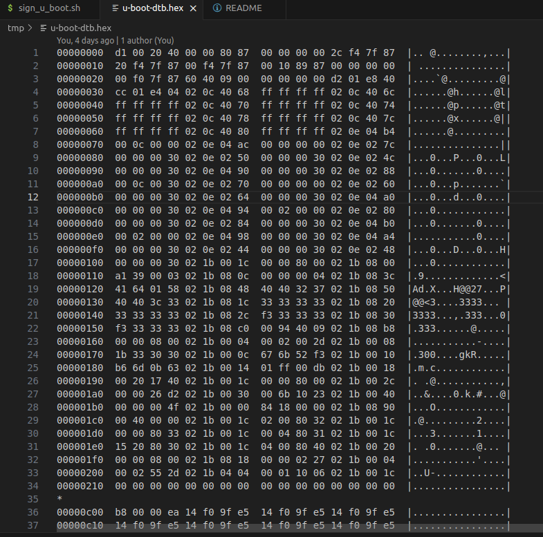
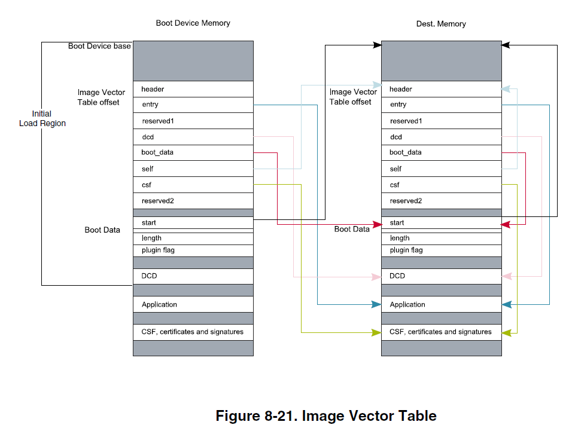
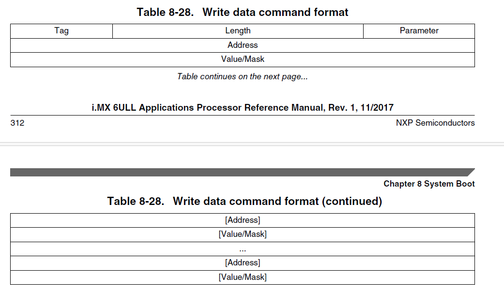
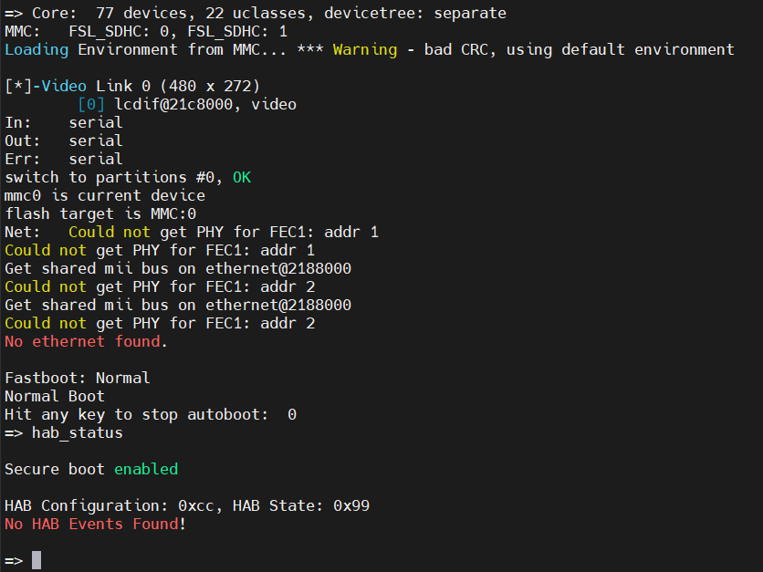
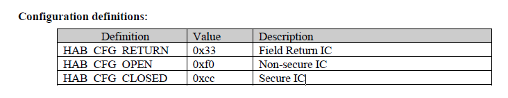
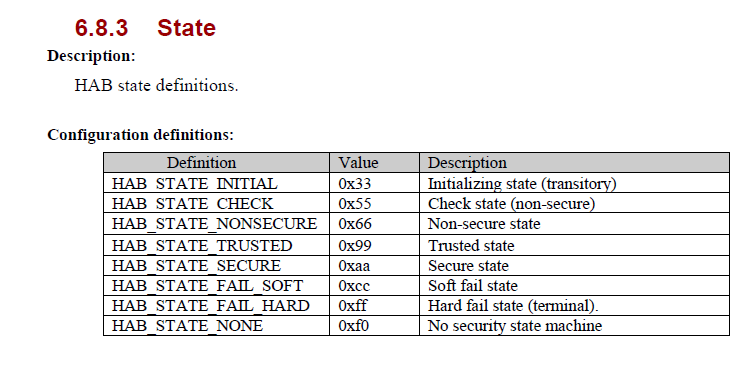

# HAB in IMX6ULL

## 1. Brief

This is a guide for HAB in IMX6ULL.

## 2. Reference

- [i.MX 6ULL Applications Processor Reference Manual](https://www.nxp.com/webapp/sps/download/preDownload.jsp?render=true)
- [AN4581 i.MX Secure Boot on HABv4 Supported Devices](https://www.nxp.com/webapp/sps/download/preDownload.jsp?render=true)
- [AN12263 HABv4 RVT Guidelines and Recommendations](https://www.nxp.com/webapp/sps/download/preDownload.jsp?render=true)
- [Code-Signing Tool User’s Guide](https://sources.debian.org/data/main/i/imx-code-signing-tool/3.3.0%2Bdfsg2-1/docs/CST_UG.pdf)
- [High Assurance Boot Version 4 Application Programming Interface Reference Manual](https://sources.debian.org/data/main/i/imx-code-signing-tool/3.3.0%2Bdfsg2-1/docs/HAB4_API.pdf)

## 3. Build u-boot

### 3.1 Prepare

- SW: This project is cloned form [nxp-qoriq/u-boot](https://github.com/nxp-qoriq/u-boot) with branch *if_v2024.04*.
- HW is base on ALPHA I.MX board from Alientek.
- Toolchain: ../toolChain/fsl-imx-x11-glibc-x86_64-meta-toolchain-cortexa7hf-neon-toolchain-4.9.11-1.0.0.sh

### 3.2 Build NXP u-boot

```shell
source /opt/fsl-imx-x11/4.9.11-1.0.0/environment-setup-cortexa7hf-neon-poky-linux-gnueabi
make mx6ull_14x14_evk_defconfig 
make u-boot.imx
```

### 3.3 Flush NXP u-boot to SD card

#### More details refer to : u-boot/doc/imx/mkimage/imximage.txt

```shell
sudo dd if=u-boot.imx of=/dev/sdb bs=512 seek=2
```

### 3.4 Add self board to u-boot

*In this project, we use *mx6ull_para_evk_defconfig*

#### 3.4.1 Copy mx6ull_14x14_evk_defconfig to mx6ull_para_evk_defconfig

```shell
cd configs
copy mx6ull_14x14_evk_defconfig  mx6ull_para_evk_defconfig
```

in mx6ull_para_evk_defconfig:
change CONFIG_TARGET_MX6ULL_14x14_EVK to CONFIG_TARGET_MX6ULL_PARA_EVK
change CONFIG_DEFAULT_DEVICE_TREE="imx6ull-14x14-evk" to CONFIG_DEFAULT_DEVICE_TREE="imx6ull-para-evk"

#### 3.4.2  copy mx6ullevk.h to mx6ull_para_evk.h

```shell
cd include/configs
copy mx6ullevk.h mx6ull_para_evk.h
```

#### 3.4.3 create para's board

```shell
cd board/freescalse
cp mx6ullevk/ mx6ull_para_evk/ -r
```

- modify mx6ull_para_evk/imximage.cfg

- change board/freescale/mx6ullevk/plugin.bin to board/freescale/mx6ull_para_evk/plugin.bin

- modify mx6ull_para_evk/Kconfig and  modify mx6ull_para_evk/MAINTAINERS and mx6ull_para_evk/Makefile
  - rename all "mx6ullevk" to "mx6ull_para_evk"
- rename mx6ull_para_evk/mx6ullevk.c to mx6ull_para_evk/mx6ull_para_evk.c
- Modify arch/arm/mach-imx/mx6/Kconfig
  - copy TARGET_MX6ULL_14X14_EVK related configurations and renamed to TARGET_MX6ULL_PARA_EVK below TARGET_MX6ULL_14X14_EVK
  - add source "board/freescale/mx6ull_para_evk/Kconfig" below source "board/freescale/mx6ullevk/Kconfig"

#### 3.4.5 dts

- copy arch/arm/dts/imx6ulz-14x14-evk-emmc.dts to arch/arm/dts/imx6ulz-para-evk.dts
- modify arch/arm/dts/Makefile: add "imx6ull-para-evk.dtb \" for dtb-$(CONFIG_MX6ULL)

#### 3.4.6 change board name  MX6ULL 14x14 EVK to  MX6ULL para EVK

- in mx6ull_para_evk/mx6ull_para_evk.c checkboard():
- modify puts("Board: MX6ULL 14x14 EVK\n");


### 3.5 Build u-boot-dtb.imx

*Details refer to ../para-script/para_build.sh*
```shell
source /opt/fsl-imx-x11/4.9.11-1.0.0/environment-setup-cortexa7hf-neon-poky-linux-gnueabi
make distclean
make mx6ull_para_evk_defconfig
make all -j16
make u-boot.imx -j4
if [ ! -e "./tmp" ]; then
    mkdir tmp
fi
rm -rf tmp/*
cp u-boot-dtb.imx tmp
cp u-boot-dtb.imx.log tmp
```

## 4. Analyze u-boot-dtb.imx and u-boot-dtb.imx.log

From Step 3, u-boot-dtb.imx and u-boot-dtb.imx.log are generated in root directory. And the build script will copy these 2 files to tmp.
Now let's analyze these 2 files.

### 4.1 Analyze u-boot-dtb.imx

First, convert .imx to .hex:

```shell
cd tmp
hexdump -C u-boot-dtb.imx > u-boot-dtb.hex
```

Then open :

### 4.1.2 IVT

This is  from imx6ull reference manual, base on this map, let's analyze IVT:

| Offset | Value | Description |
| :---: | :---: | :---: |
| 0x00  | 0x402000D1 | IVT Header |
| 0x04  | 0x87800000 | IVT Entry |
| 0x08  | 0x00000000 | IVT Reserved 1 |
| 0x0C  | 0x877FF42C | IVT DCD address |
| 0x10  | 0x877FF420 | IVT BOOT DATA address |
| 0x14  | 0x877FF400 | IVT Self address |
| 0x18  | 0x87891000 | IVT CSF address |
| 0x1C  | 0x00000000 | IVT Reserved 2 |

### 4.1.3 Boot Data

The address of boot data is 0x877FF420.

| Offset | Value | Description |
| :---: | :---: | :---: |
| 0x00  | 0x877ff000| Start: Absolute address of the image |
| 0x04  | 0x094060 | Length: Size of the program image |
| 0x08  | 0x00000000 | Plugin|

### 4.1.4 DCD

The address of boot data is 0x877FF42C.

- Header Format: 
Tag: A single-byte field set to 0xD2
Length: a two-byte field in the big-endian format containing the overall length of the DCD
(in bytes) including the header
Version: A single-byte field set to 0x41

| Tag | Length | Version |
| :---: | :---: | :---: |
| 0xD2 | 0x01e8| 0x40 |

- Write data command format
:

| Tag | Length | Parameter |
| :---: | :---: | :---: |
| 0xCC | 0x1e4 | 0x04 |

| Address | Value | Register |
| :---: | :---: | :---: |
| 0x020c4068 | 0xFFFFFFFF | CCM |
| ... | ... |  CCM |
| 0x020c4068 | 0xFFFFFFFF |  CCM |
| 0x020e40be | 0x000c0000 | IOMUX GPR |
| ... | ... |  IOMUX GPR |
| 0x020e04a4 | 0x00000030 |  IOMUX GPR |
| 0x020e0244 | 0x00000030 | IOMUX Register |
| ... | ... |  IOMUX Register |
| 0x020e0248 | 0x00000030 |  IOMUX Register |
| 0x021b001c | 0x00008000 | MMDC Register |
| ... | ... |  MMDC Register |
| 0x021b08b8 | 0x00000000 |  MMDC Register |

### 4.1.5 CSF

The address of boot data is 0x87891000.
Offset of CSF = 0x87891000 - 0x877FF420 = 0x00091C00.
Ths csf.bin will be attached here while signing u-boot-dtb.imx.

### 4.2 Analyze u-boot-dtb.imx.log

#### 4.2.1 Image Type: Freescale IMX Boot Image

- Indicates this is a boot image file format for Freescale (now NXP) i.MX series processors
- This is a dedicated image format for i.MX chips, containing necessary information for booting

#### 4.2.2 Image Ver: 2 (i.MX53/6/7 compatible)

- The image version number is 2
- Compatible with i.MX53, i.MX6, and i.MX7 series processors
- Different versions may support different features or formats

#### 4.2.3 Mode: DCD

- DCD (Device Configuration Data) mode
- Indicates the image contains DCD data for initializing peripherals such as DDR memory
- This is an important configuration method during i.MX chip boot-up

#### 4.2.4 Data Size: 606304 Bytes = 592.09 KiB = 0.58 MiB

- The image data size is 606,304 bytes
- Also provides the converted values in KB and MiB units
- This size includes all content of the entire image

#### 4.2.5 Load Address: 877ff420

- The address where the image is loaded into memory
- This is a hexadecimal address
- The Boot ROM will load the image data to this memory location

#### 4.2.6 Entry Point: 87800000

- The program entry point address
- After loading, the CPU will start execution from this address
- This address is typically located after the load address and may contain the code segment

#### 4.2.7 HAB Blocks: 0x877ff400 0x00000000 0x00091c00

- HAB (High Assurance Boot) related information
- First value (0x877ff400): Start address of HAB block
- Second value (0x00000000): Offset
- Third value (0x00091c00): Block size
- This information is used for secure boot verification

#### 4.2.8 DCD Blocks: 0x00910000 0x0000002c 0x000001e8

- DCD block configuration information
- First value (0x00910000): Offset address of DCD in the image
- Second value (0x0000002c): Offset of DCD header
- Third value (0x000001e8): Size of DCD data
- This data is used to configure key peripherals such as DDR controllers

## 5. Sign u-boot-dtb.imx

## 5.1 Install CST

- Download [cst-3.1.0.tgz](https://www.nxp.com/webapp/sps/download/license.jsp?colCode=IMX_CST_TOOL)
- Unzip cst-3.1.0.tgz

## 5.2 Generating HAB4 Keys and Certificates

I.MX 6ULL use HAB4 to sign u-boot-dtb.imx. More details about generate HAB4 keys and certificates, refer to **Code-Signing Tool User’s Guide** in **<span style="color:green">2. Reference</span>**:

- 3.2.2 Running the hab4_pki_tree script Example
- 3.2.3 Generating HAB4 SRK tables and Efuse Hash
- or [introduction_habv4.txt](../doc/imx/habv4/introduction_habv4.txt)

After operate the above steps, the HAB4 keys and certificates will be generated in the keys and crts directories . Here 2 files in crts need to be described:

- SRK_1_2_3_4_fuse.bin: will be used for fuse programming
- SRK_1_2_3_4_table.bin: will be used for u-boot-dtb.imx signing

## 5.3 Sign u-boot-dtb.imx

In step 3, u-boot-dtb.imx was generated. Now let's sign u-boot-dtb.imx.
The intruction [mx6_mx7_secure_boot.txt](u-boot/doc/imx/habv4/guides/mx6_mx7_secure_boot.txt) is strongly recommended to be followed.

## 5.4 verify csf signature

In step **4.1.5 CSF**, CSF offset is 0x91c00. To verify the csf signature in u-boot-signed.imx, we should use the following steps:  

### 5.4.1 Compare csf signature with csf.bin and u-boot-signed.imx

- Convert csf.bin to csf_uboot.hex

```shell
hexdump -C ../tmp/csf.bin > ../tmp/csf_uboot.hex
```

- Copy csf_cat.bin from u-boot-signed.imx and convert to csf_cat.hex

$IMG_SIZE = 0x91c00

```shell
dd if=../tmp/u-boot-dtb-new-CSF-signed.imx of=../tmp/csf_cat.bin bs=1 skip=$IMG_SIZE
hexdump -C ../tmp/csf_cat.bin > ../tmp/csf_cat.hex
```

- Compare csf_cat.hex and csf_uboot.hex

```shell
cmp -l ../tmp/csf_uboot.hex ../tmp/csf_cat.hex
```

If the output is empty, it means the two files are identical.

### 5.4.2 Use csf_parser to check csf signature in u-boot-signed.imx

- Install CSF Parser: Refer to [README](./code/hab_csf_parser/README)

- Check CSF in csf_uboot.bin

```shell
./csf_parser -d -c csf_uboot.bin
```

[csf_parser_csf_uboot.png](../para-script/csf_parser_csf_uboot.png)

- Use csf_parser to check csf signature in u-boot-signed.imx

```shell
./csf_parser -d -s ../tmp/u-boot-signed.imx
```

[csf_parser_u_boot_signed.png](../para-script/csf_parser_u_boot_signed.png)

### 5.4.3 Analyze the csf signature

CSF signature is described in file **High Assurance Boot Version 4 Application Programming Interface Reference Manual**.
You can analyze the csf_uboot.hex to understand the csf signature.
Otherwise, csf_parse command will also generate [parsed_output.txt](./output/parsed_output.txt) and [debug_log.txt](./output/debug_log.txt) to describe the csf signature in u-boot-signed.imx or csf_uboot.bin.

## 5.6 Fuse programming

Refer to **1.5 Programming SRK Hash** in [mx6_mx7_secure_boot.txt](../doc/imx/habv4/guides/mx6_mx7_secure_boot.txt).

---
**<span style="color:red">Note</span>**

**<span style="color:red">DO NOT Program SEC_CONFIG[1] fuse before verifying HAB events!!! Otherwise, the device will not boot a signed image.</span>**

## 5.7 Verify HAB events with u-boot-signed.imx

### 5.7.1 Program u-boot-signed.imx to sd card

*SD card in my Ubuntu system is /dev/sdb.*

```shell
sudo dd if=u-boot-signed.imx of=/dev/sdb bs=1k seek=1 conv=fsync
```

### 5.7.2 Check HAB events


Let's analyze HAB events. More details refer to **High Assurance Boot Version 4 Application Programming Interface Reference Manual** in **Reference**.

```shell
=> hab_status

Secure boot enabled

HAB Configuration: 0xcc, HAB State: 0x99
No HAB Events Found!
```

HAB Configuration: 0xcc, means **Secuse ICC** is enabled. **I have programmed the SEC_CONFIG[1] fuse.**

HAB State: 0x99, Trusted state.


At this point, the entire process of porting uboot and signing uboot to secure boot on the actual board has been completely completed.
And you can **Program SEC_CONFIG[1] fuse** now.

## 5.8 Script to sign u-boot-dtb.imx and program u-boot-signed.imx to sd card

To make the signature process more convenient, the following script is provided:

- [para-download-sd.sh](../para-script/para-download-sd.sh)

```shell
#!/bin/bash

set -e

if [ $# -ne 1 ]; then
    echo "Usage: $0 <u-boot.imx>"
    exit 1
fi

# Define variables
DEVICE="/dev/sdb"
# IMAGE="tmp/u-boot-imx6ull-para.imx"
IMAGE=$1

# Check if device exists
if [ -e "$DEVICE" ]; then
    echo "Device $DEVICE detected"
    
    # Check if image file exists
    if [ ! -f "$IMAGE" ]; then
        echo "Error: Image file $IMAGE does not exist"
        exit 1
    fi
    
    echo "WARNING: About to flash u-boot to $DEVICE"
    echo "This operation will erase all data on the device!"
    read -p "Are you sure you want to continue? (Type 'yes' to continue): " confirm
    
    if [ "$confirm" != "yes" ]; then
        echo "Operation cancelled"
        exit 1
    fi
    
    # Flash image
    echo "Flashing u-boot to $DEVICE..."
    sudo dd if="$IMAGE" of="$DEVICE" bs=1k seek=1 conv=fsync
    
    if [ $? -eq 0 ]; then
        echo "Flashing completed!"
         # Sync cache to ensure all data is written
        echo "Syncing data..."
        sync
        
        # Eject device
        echo "Ejecting device..."
        sudo eject "$DEVICE"
        
        if [ $? -eq 0 ]; then
            echo "Device safely ejected, SD card can be removed"
        else
            echo "Warning: Device ejection failed, but data writing is complete"
            echo "You can manually remove the SD card"
        fi
    else
        echo "Error: Flashing failed"
        exit 1
    fi
    
else
    echo "Error: Device $DEVICE does not exist"
    exit 1
fi

exit 0
```

- [sign_u_boot.sh](sign_u_boot.sh)

```shell
#!/bin/bash
# filepath: sign_u_boot.sh
# Usage: ./sign_u_boot.sh u-boot-dtb.imx 
# these steps fellow NXP_u-boot/doc/imx/habv4/guides/mx6_mx7_secure_boot.txt
set -e

if [ $# -ne 1 ]; then
    echo "Usage: $0 <u-boot-dtb.imx>"
    exit 1
fi

IMAGE=$1

if [ ! -f "$IMAGE" ]; then
    echo "Error: $IMAGE not found!"
    exit 1
fi

SCRIPT_DIR=$(dirname "$0")
CST_TOOL="${SCRIPT_DIR}/linux64/bin/cst"
CRT_DIR="${SCRIPT_DIR}/crts"

# check CST tool and certificate directory
if [ ! -f "$CST_TOOL" ]; then
    echo "Error: $CST_TOOL not found!"
    exit 1
fi

if [ ! -d "$CRT_DIR" ]; then
    echo "Error: Certificate directory $CRT_DIR not found!"
    exit 1
fi

# 1. generate CSF description file
if [ ! -f ${IMAGE}.log ]; then
    echo "Error: ${IMAGE}.log not found!"
fi

ENTRY_BLOCKS=`grep 'Entry Point:' ${IMAGE}.log`
ENTRY_POINT=`awk '{print $3}' <<< ${ENTRY_BLOCKS}`

HAB_BLOCKS=`grep 'HAB Blocks:' ${IMAGE}.log`
RAM_AUTH_AREA_START=`awk '{print $3}' <<< ${HAB_BLOCKS}`
IMG_SIGN_AREA_START=`awk '{print $4}' <<< ${HAB_BLOCKS}`
IMG_SIGN_AREA_SIZE=`awk '{print $5}' <<< ${HAB_BLOCKS}`

if [ -z "$RAM_AUTH_AREA_START" -o -z "$IMG_SIGN_AREA_START" -o -z "$IMG_SIGN_AREA_SIZE" ]; then
    echo "Error: log file is corrupted"
    shift
    continue
fi

for arg in ENTRY_POINT RAM_AUTH_AREA_START  IMG_SIGN_AREA_START  IMG_SIGN_AREA_SIZE; do
    eval value=\$$arg
    if [ ${value:0:2} != 0x ]; then
        value=0x${value}
        eval $arg=\$value
    fi
done

CSF_FILE="${SCRIPT_DIR}/csf_uboot.txt"

cat > "$CSF_FILE" <<EOF
[Header]
Version = 4.2
Hash Algorithm = sha256
Engine = SW
Engine Configuration = 0
Certificate Format = X509
Signature Format = CMS

[Install SRK]
File = "$CRT_DIR/SRK_1_2_3_4_table.bin"
Source index = 0

[Install CSFK]
File = "$CRT_DIR/CSF1_1_sha256_2048_65537_v3_usr_crt.pem"

[Authenticate CSF]

[Install Key]
Verification index = 0
Target index = 2
File = "$CRT_DIR/IMG1_1_sha256_2048_65537_v3_usr_crt.pem"

[Authenticate Data]
Verification index = 2
# Blocks = 0x877ff400 0x00000000 0x00091c00 "../tmp/u-boot-dtb.imx"
Blocks = $RAM_AUTH_AREA_START   $IMG_SIGN_AREA_START   $IMG_SIGN_AREA_SIZE  "${IMAGE}"
EOF

echo "generate CSF description file: done"
# 3. generate CSF binary file
# ./linux64/bin/cst -i "$CSF_FILE" -o "${IVT_IMAGE}_csf.bin"
"$CST_TOOL" -i "$CSF_FILE" -o "${SCRIPT_DIR}/csf_uboot.bin"
echo "generate CSF binary file: done"

# 4. Merge u-boot.ims and csf.bin
cat "../tmp/u-boot-dtb.imx" "${SCRIPT_DIR}/csf_uboot.bin" > "../tmp/u-boot-signed.imx"

echo "Sign u-boot complete."

# 5. check CSF section in u-boot-signed.imx
# refer to CST/code/hab_csf_parser/README
echo "Check CSF in csf.bin."
csf_parser -d -c "${SCRIPT_DIR}/csf_uboot.bin"
echo "Check CSF in u-boot-signed.imx."
csf_parser -d -s ../tmp/u-boot-signed.imx
echo "Check CSF complete."

# 5. - Flash signed U-Boot binary:
#   sudo dd if=u-boot-signed.imx of=/dev/sd<x> bs=1K seek=1 && sync

FLUSH_IMAGE="../tmp/u-boot-signed.imx"

../para-script/para-download-sd.sh $FLUSH_IMAGE
```
